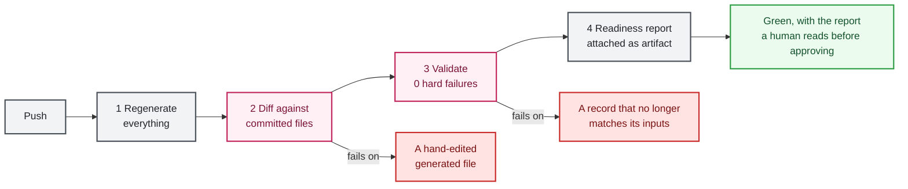

# Continuous integration

Two interchangeable implementations ship here, enforcing the same gates. Pick whichever fits your environment. The security comes from the gates, not from the vendor.

## The four gates

Whichever you run, this is what must happen on every change:

1. **Regenerate everything** from the pinned dataset and the record store.
2. **Fail on any hand-edited output.** Regenerate, then diff. If a generated file differs from what the pipeline produces, the build fails. This turns "do not edit generated files" from a convention into an error.
3. **Validate with zero hard failures.** `python sdr.py validate` runs the full validation gate (SDR schema/coverage/fidelity, package schemas, CPO semantics, assurance-graph traceability, the human review register, evidence integrity, and cross-artifact consistency) plus the offline test suite. GitHub Actions additionally enforces a double-build reproducibility gate and the scanner-catalog freshness check.
4. **Attach a readiness report** so a human approver can read it before signing.

Submission readiness (`preflight`) is deliberately not one of these build-time gates: it is a stricter, separate check run at submission time. See [validation and readiness](validation.md#submission-readiness-preflight).



Gate 2 is the one people leave out, and it is the one that keeps the whole traceability claim honest. Without it, someone edits the JSON directly under deadline pressure and the record silently stops matching its inputs.

## GitHub Actions

No AWS account needed. Free-tier friendly.

| Workflow | Trigger | What it does |
|---|---|---|
| `.github/workflows/validate.yml` | push, pull request | Runs the four gates, the two anti-circular audit gates (below), refuses a stale scanner check catalog, attaches the readiness report as a build artifact |
| `.github/workflows/drift-check.yml` | daily schedule | Hash-compares pinned FedRAMP sources against upstream, opens an issue on drift |

### Anti-circular-verification audit gate

The `audit-gate` job in `validate.yml` runs two independent checks that a green test suite alone cannot provide, both hard gates:

- **Mutation runner** (`audit/mutation_tests.py`) re-introduces each closed defect into the production code and asserts its named regression test goes red. A surviving mutation means a test cannot detect the defect it claims to guard, and the build fails. When you fix a new defect, add a mutation entry and a ledger record (`audit/defect-ledger.json`); the runner skips a mutation whose target code is not present, so a fix on an unmerged branch never passes falsely.
- **Requirements-differential oracle** (`audit/requirements_oracle.py`) derives the KSI universe and the Class-B-optional set from the raw pinned dataset with a traversal independent of the production applicability engine, then reconciles the two. Any discrepancy fails the build.

The AWS CodeBuild release path (`RELEASE_MODE=true`) runs the same two checks, so the internal pipeline is not weaker than the public gate.

Actions are pinned to full commit SHAs rather than tags, so a compromised or retagged upstream action cannot change what runs in your pipeline. Keep it that way when you add steps.

## Local security gate (ASH and Fortify)

Security scanning does not run in the external repo's CI. Both scanners are local pre-merge gates you run before committing to `main`, and again on a fresh local copy of `main` after a merge:

| Scanner | Command | What it covers |
|---|---|---|
| ASH (AWS Automated Security Helper) | `scripts/ash_scan.sh` or `.\scripts\ash_scan.ps1` | Bandit, checkov, detect-secrets, cdk-nag. Scope and suppressions in `.ash.yaml` |
| Fortify SCA | `scripts/fortify_scan.sh` or `.\scripts\fortify_scan.ps1` | Deeper dataflow and structural analysis. Suppressions in `.fortify/sdr-filter.txt` |

Install the pre-push hook once per clone (`.\scripts\install-fortify-hook.ps1`) and both run automatically on a push to `main`. Feature-branch pushes are not gated. See [scripts/README-fortify.md](../scripts/README-fortify.md) for install and override details. Emergency bypass: `git push --no-verify`.

## AWS CodePipeline

Use this when the provider wants approval, publication, evidence storage, and scheduled collection inside their own AWS environment. `automation/pipeline/` holds a deployable reference, modeled on the AWS DevSecOps pipeline pattern but with SDR-specific gates in place of the usual composition, static, and dynamic analysis scanners.

| Stage | What happens | Rule it supports |
|---|---|---|
| Source | A push to your private SDR repository via AWS CodeConnections triggers the pipeline | `CMT` change management practices |
| Validate and package | CodeBuild regenerates every deliverable, fails on any hand-edited file, then runs the validator requiring zero hard failures | `FRC-CSX-VVR` persistent automated verification and validation |
| Readiness scan | The scanner writes per-rule and per-indicator findings into the build artifact. Reports, does not gate | `CDS-CSO-CBF`, `FRC-CSX-VVR` |
| Human approval | Amazon SNS emails an approver, who can read the readiness report before signing. Nothing publishes without sign-off | Human-gated statuses |
| Publish | Deliverables land in a versioned, encrypted Amazon S3 bucket that can back a trust center or package delivery | `FRC-CSO-JSN`, `SDR-CSO-MTD` |
| Daily drift check | Hash-compares pinned sources against fedramp.gov and alerts on change | Source currency |
| Daily collector, opt-in | Runs the read-only facts collector into an evidence bucket | `SDR-CSX-KMT` metrics, `FRC-CSX-MOT` persistent validation |

### Deploying

Create and authorize the CodeConnections connection to your git host once in the console first, then:

```bash
aws cloudformation deploy \
  --template-file automation/pipeline/sdr-pipeline.yaml \
  --stack-name sdr-pipeline \
  --capabilities CAPABILITY_IAM \
  --parameter-overrides \
    ConnectionArn=arn:aws:codeconnections:REGION:ACCOUNT:connection/ID \
    FullRepositoryId=your-org/your-sdr-repo \
    NotificationEmail=approver@example.com
```

The template avoids hardcoded partitions, so its ARNs are partition-aware. Deployment still requires every selected service and source integration to be available in the target Region: the GitHub source uses AWS CodeConnections, which is **not** available in AWS GovCloud (US-West) as of September 2026 (it does have an endpoint in AWS GovCloud US-East). In a Region without CodeConnections GitHub support, swap the Source stage for a supported provider. AWS CodeCommit is not used because it is closed to new customers; the source is any git host CodeConnections supports.

Buildspecs live alongside the template: `buildspec-validate.yml`, `buildspec-drift-check.yml`, `buildspec-collect.yml`.

## Running against your own record

Fork or clone, then point your pipeline at your private repository. Do not open pull requests against this repository containing your real record.

One thing to get right before your first push: confirm the secret scan is running. `no_sensitive_patterns` checks every deliverable for account identifiers, access keys, and private keys. It is part of the validator, so it runs in gate 3, but verify it fires in your environment rather than assuming it.

See [validation](validation.md) for what each gate checks, and [automation](automation.md) for the collector the scheduled stage runs.

## Public certification-JSON headers (deployment hardening)

Since CR26 dataset `2026.10.05.01`, FRC-CSO-JSN (force MUST) states that "public JSON data MUST be supplied in a manner compatible with modern web frameworks, including:" and lists two expectations verbatim in its `following_information`: "Cross-Origin Resource Sharing (CORS) should allow web applications running on a different domain to access the public JSON data directly." and "Proper web application headers should be supplied for public JSON data, including at least setting Content-Type to application/json and X-Content-Type-Options: nosniff." The MUST is compatibility with modern web frameworks; the two listed items are the rule's own "should" expectations of what that includes. FedRAMP Help Center guidance (September 15, 2026) additionally RECOMMENDS `Content-Disposition: attachment` for certification-JSON downloads; that header is not named by any Consolidated Rule.

These apply to your provider-hosted public endpoint (for example a Trust Center), not to this repository's S3 publish step. The package preflight does not gate on headers: whether your endpoint meets FRC-CSO-JSN is recorded in your FRC-CSO-JSN record and assessed by your assessor. Check the endpoint with the advisory helper, which reports presence and nothing more:

```bash
python automation/pipeline/check_json_download_headers.py --url https://<your-trust-center>/certification.json
# or evaluate a saved headers file, advisory by default:
python automation/pipeline/check_json_download_headers.py --headers-file headers.json
```

It exits 0 by default and labels each header with its source (the rule or the guidance); pass `--strict` to make an absent header a non-zero exit in your own deployment gate.
