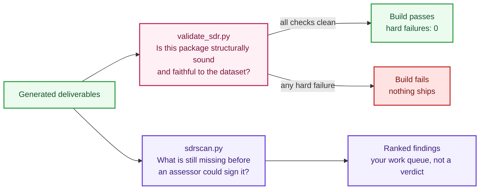

# Validation and readiness

The repository checks the record twice, for two different questions. They are not redundant, and confusing them is the most common misreading of the output.



The gate can pass while the scanner reports two thousand findings, and on a fresh clone it does exactly that. A structurally perfect record with honest `TBD`s everywhere is shippable as a build and nowhere near assessable, and the tools are separated so those two statements can both be true at once.

| | `validate_sdr.py` | `sdrscan.py` |
|---|---|---|
| Question | Is this package structurally sound and faithful to the dataset? | What is still missing before an assessor could sign it? |
| Output | 14 aggregate checks, one exit code | One finding per resource per check, severity-ranked |
| Gates the build | Yes. Zero hard failures required | No. Reports only |
| On a fresh template | Passes, with one expected soft failure | Thousands of findings, which is correct |
| Supports | `FRC-CSO-JSN` schema conformance, `CDS-CSO-CBF` format consistency | `FRC-CSX-VVR` persistent verification, `CDS-CSO-CBF` |

## The build gate

```bash
python sdr.py validate
```

Fourteen checks, in order:

| Check | What it does | Failure means |
|---|---|---|
| `official_schema_validation` | Validates generated JSON against the pinned official FedRAMP SDR schema | The deliverable would be rejected. Zero errors required |
| `dataset_version_agreement` | The dataset version pinned in the profile matches the dataset's own `info.version` | The record was built against a different dataset than it claims |
| `pinned_schema_version_guard` | All nine pinned official schemas match their expected `$id` and version | A pinned schema drifted from the version the record targets |
| `rule_coverage` | Compares rules present against the class profile, both directions | A rule is missing, or one appears that does not belong to the class |
| `ksi_coverage` | All 46 indicators present for classes B and up | An indicator was dropped |
| `ksi_required_fields` | Every indicator carries the six schema-required fields | A field the schema demands is absent |
| `ksi_test_minimums` | Automated methods per indicator against the `FRC-CSX-VVK` minimum for the class | See the soft failure note below |
| `no_markdown_in_human_readable` | Deliverable text is clean plain text, no markdown symbols | Formatting leaked into a document meant to be read as text |
| `no_sensitive_patterns` | Scans all deliverables for account identifiers, access keys, private keys | Something that must never be committed is in a deliverable |
| `content_fidelity_against_dataset` | Re-derives every statement, name, force, and family expansion from the dataset and compares | Either a builder is wrong, or a generated file was hand-edited |
| `semantic_completeness_cr26` | Every `SDR-CSO-FRR` and `SDR-CSX-KSI/KMT` required item is present (presence, not correctness) | A required semantic element is absent from the submitted SDR |
| `no_stale_nist_800_63_3` | No superseded SP 800-63 edition is referenced (the current edition is SP 800-63-4) | Generated or authored content cites a superseded edition |
| `evidence_linkage_for_populated_musts` | Populated KSIs carry an evidence entry (force `SHOULD` at Class B, `MUST` at C/D) | A populated KSI has no evidence; hard only where the force is `MUST` |
| `sources_lock_consistency` | Every pinned source matches its recorded sha256 in `sources.lock.json` | A pinned source drifted from its lock hash |

The line that gates the build is `hard failures: 0`. Two of these (`ksi_test_minimums` and `evidence_linkage_for_populated_musts`) are `SHOULD`-force advisories at Class B, so they report as soft failures during authoring and become hard only where the FedRAMP force is `MUST`.

### The two expected advisories

On a fresh Class B clone you will see two advisory (soft) failures:

```
ADVISORY: ksi_test_minimums | 46 KSIs below the FRC-CSX-VVK AUTOMATED-method minimum for class B
ADVISORY: evidence_linkage_for_populated_musts | populated KSIs with no evidence entry
```

Both are correct and expected. `FRC-CSX-VVK` requires automated validation methods per indicator, and evidence linkage expects a populated KSI to carry evidence; a template has neither yet. At Class B the FedRAMP force for both is `SHOULD`, so they are classified as soft failures during authoring - they do not block the build - and `evidence_linkage_for_populated_musts` becomes a hard failure at Class C/D where the force is `MUST`. If they were hard from the start, nobody could run the pipeline on a fresh clone, and the usual response would be to disable the check, which is worse. `hard failures: 0` is the line that gates the build.

### Why content fidelity matters most

`content_fidelity_against_dataset` is the check that makes the traceability claim real. The validator does not read what the builders produced and assume it is right. It independently resolves every rule from the pinned dataset through its own code path, then compares. A bug in `build_sdr.py` cannot slip through by sharing an assumption with the validator, because the validator does not share the builders' code.

It is also how the repository enforces "never hand-edit generated files." If you edit `sdr/json/sdr-class-c.json` directly, this check fails on the next run. Regenerate instead: `python sdr.py build`.

## The readiness scanner

```bash
python automation/sdrscan/sdrscan.py --only-fails
```

38 checks producing one finding per rule and per indicator. Each finding carries the check that fired, the resource, the severity, the FedRAMP rule that makes it a requirement, and the exact JSON path to fix. The model is deliberately close to Prowler's: findings, not a score.

Useful invocations:

```bash
# Triage: the findings that matter most
python automation/sdrscan/sdrscan.py --only-fails --severity critical,high

# Indicators only
python automation/sdrscan/sdrscan.py --only-fails --resource-type KSI

# One check, while you clear it
python automation/sdrscan/sdrscan.py --check ksi_test_minimum_met --only-fails

# What checks exist
python automation/sdrscan/sdrscan.py --list-checks

# Machine-readable for a dashboard
python automation/sdrscan/sdrscan.py --output-formats json,csv
```

Output formats are `json`, `csv`, `html`, `txt`, and `none`. Reports land in `validation/reports/sdrscan/` and are git-excluded because they are build outputs.

Reports carry no run timestamp by default so repeated scans of unchanged inputs are byte-identical. Add `--timestamp` when you want the real run time recorded, for example when attaching a report to an assessment package.

### Thousands of findings is the correct answer

Against the shipped template the scanner reports thousands of failures. That is not a bug, and it is not softened. A template has genuinely open gaps, and a tool that reported green on an empty record would be worse than no tool. The scanner drives the filling-in work; it does not gate the build.

Full check reference: [automation/sdrscan/README.md](../automation/sdrscan/README.md).

## The full validation gate

`validate_sdr.py` is the SDR checker described above, and it is the anchor of the gate. `python sdr.py validate` runs it together with the rest of the validation gate and the offline test suite (this is what continuous integration runs). The other gate checks, each independent and each a hard gate:

| Gate check | What it enforces |
|---|---|
| `validate_sdr.py` | The 14 build-gate checks above (schema, coverage, minimums, hygiene, content fidelity, semantic completeness, source lock) |
| `validate_package.py` | The CPO and OCR against their official FedRAMP schemas |
| `validate_cpo_semantics.py` | CPO rule-completeness, not just schema: it independently derives the applicable `CPO-CSO-OVR` rule set from the dataset and checks structured completeness of the enumerated rules (`CDS-CSO-PUB`, `CDS-CSO-IRP`, `MAS-CSO-TPR`) |
| `validate_assurance_graph.py` | Full-chain traceability across the assurance graph, class-scoped |
| `validate_reviews.py` | The human review register carries no machine-authored approvals |
| `validate_evidence.py` | Live evidence integrity: it recomputes digests and fails on malformed or mismatched ones. When an evidence entry carries a KMS signature, its signed-hash binding must still match the current content (a stale binding is a hard failure) |
| `validate_evidence_store_controls.py` | The evidence-store control mapping (`traceability/evidence-store-controls.json`) cites only control identifiers that appear verbatim in the pinned CR26 dataset |
| `validate_isolation_stack.py` | The evidence-store isolation reference stack keeps its load-bearing invariants (WORM, deny-collector-mutation, deny-collector-sign, separate signer, separate access logging) |
| `validate_package_consistency.py` | Cross-artifact consistency across the generated package |

## Submission readiness (preflight)

The build gate answers a structural question: is this package well-formed and faithful to the dataset? Submission readiness answers a stricter, separate question: is this package actually ready to hand to an assessor? That is `preflight`, and it is deliberately hard to fool.

```bash
python sdr.py package-preflight        # the generated package
python sdr.py application-preflight     # package checks plus FedRAMP application prerequisites
```

Both are read-only, exit non-zero while anything blocks, and never author an approval. What preflight enforces, all grounded verbatim in the pinned dataset:

- **Field-level readiness, and no content-free non-answers.** Every required `SDR-CSO-FRR` item (implementation/risk, verification, validation, independent verification, independent validation, assessor responses) and every required `SDR-CSX-KSI` item (measures, cycle, measures verification, automation verification, validation) is checked individually. A field is not answered by a placeholder OR by a bare non-answer token: `TBD`, an empty value, `N/A`, `none`, `.`, `unknown`, and the like all block. A justified `N/A: <reason>` (a real reason after the marker) passes, because FedRAMP allows a justified non-implementation. This same content-quality test (a single `_is_hollow` predicate) is applied everywhere a required content value is read: the required offering-profile fields, the `FRC-APP-FIA` assessor name and FedRAMP Recognition id, the Sales and Security contact names, the `CPO-CSO-MTD` metadata, the `CPO-CSO-OSA` overall assessment summary, the CPO structured required-information members, and the two conditions that can UNBLOCK a gate (the `FRC-CSX-MOT` initial-certification exception narratives and the `FRC-APP-USA` freshening reviewer/id/reference). A content-free freshening or exception cannot loosen a gate. Date, URI, and hash fields keep the narrower placeholder test, since their own format check catches a non-answer.
- **`SDR-CSX-KMT` historical-metric summaries.** At Class C (and D) the per-KSI historical-metric summaries are a MUST and a readiness blocker, not a warning; at Class B they are a SHOULD since dataset `2026.10.08.01` (MUST before) and preflight reports the shortfall as one advisory: the 30-day and up-to-one-year summaries at Class B, plus the actual daily metric data (`dailyData`, derived from the durable metric history) at Class C and D; the external `dailyDataReference` URL is optional, not the requirement. A genuinely multi-metric KSI must also carry the per-metric "summary of each metric" breakdown at Class B, C, and D. Preflight blocks an unresolved (or content-free) KMT summary through the KSI unanswered-requirement gate. This is separate from the `FRC-CSX-MOT` duration gate, which checks that the metric HISTORY spans long enough; a package can satisfy the duration and still be blocked here for empty summaries.
- **Class-correct scope.** Class A is scoped to its seven enumerated KSIs; the CPO required-information set is the intersection of `CPO-CSO-OVR` with the resolved class rule set (Class A carries only `CDS-CSO-PUB` and `MAS-CSO-IIR`), and the `CPO-CSO-MTD` metadata gate only applies when that rule resolves for the class.
- **Structured CPO completeness, member by member.** A bare sentence does not satisfy a rule that enumerates concrete items; `CDS-CSO-PUB`, `CDS-CSO-IRP`, and `MAS-CSO-TPR` are checked against their CR26-enumerated members, and each member VALUE must be real content (not a bare non-answer per the content-quality test above), not merely present.
- **Class A external assessment (`FRC-CLA-ASF`/`FRC-CLA-EAM`).** The framework must be one FedRAMP approves (FedRAMP Rev5/Ready, SOC 2 Type II, GovRAMP) within the past 12 months, and the framework-specific material checklist must be complete.
- **Recognized-assessor identity.** The `FRC-APP-FIA` initial assessment (Class B/C) requires the assessor's FedRAMP Recognition id; an `FRC-APP-USA` freshening of a 3-to-9-month-old assessment requires a Recognized reviewer id and a `reviewed_at` date on or after the original assessment.
- **Persistent-validation history (`SDR-CSX-KMT`; `FRC-CSX-MOT` before dataset `2026.10.08.01`).** Availability survivability (`CDS-CSO-AVR`) is a Class B/C blocker; entirely-missing KSIs are detected; coverage of the up-to-one-year reference period is measured and reported (no minimum duration exists in the dataset); continuity across the evaluated window is gated against the project tolerance; and the initial-certification commitment in the rule's note is activated by an explicit contract (both boolean flags true plus descriptions/references, a `metrics_available_since` inside the reference period, and a current datapoint per in-scope KSI).
- **Manifest-bound human signoff.** The signoff in the review register is bound to the release-manifest hash, and the manifest hashes the authoritative provider inputs (offering profile and records store). Any change to those inputs after signoff invalidates the signoff.

Missing or stale evidence is reported as a readiness finding, never silently treated as a compliance pass, and the pipeline never authors an approval on a human's behalf.

A fully-worked, fictional Class C package that exercises these readiness gates end to end, plus an assessor-attack harness that tampers a ready package one hollowing edit at a time and asserts each is blocked, lives in [examples/sample-offering-class-c/](../examples/sample-offering-class-c/README.md). Run its `--attack` mode to see the readiness gating defended against structurally-complete-but-content-free submissions.

### Keeping the catalog in step

The check registry is mirrored in `automation/sdrscan/check-catalog.json`, and continuous integration refuses a stale one. After changing `checks.py`:

```bash
python automation/sdrscan/sdrscan.py --write-catalog
```

## Determinism

Generated JSON, text, and CSV are byte-identical across runs of unchanged inputs, verified by double-run hash comparison. No run timestamps are embedded anywhere. This lets a reviewer regenerate your package and confirm it matches what you shipped, which is a stronger claim than asking them to trust the file.

Word files are the exception. Their zip container embeds file-entry timestamps, so bytes differ between runs while content is identical.

To record when your content actually changed, set `sdr_last_updated` in `profiles/common/offering-profile.json`. It is manual on purpose, so that a rebuild does not falsely claim your record was updated today.

## Upstream drift

FedRAMP updates schema files in place without renaming them, so a pinned copy can silently go stale. Two mechanisms catch it.

The scheduled drift check hash-compares the pinned dataset, its rules schema, all nine official document schemas, and the FedRAMP `2026-markdown` changelog against the live copies daily, and opens an issue naming every drifted source. In this repository it runs as `.github/workflows/drift-check.yml`; the AWS reference implements the same thing on an EventBridge schedule. A download failure fails the run without filing a drift issue, so an issue always means upstream really changed.

For automated agent sessions, a SessionStart hook reads the dataset, both schemas, the dataset's own JSON schema, FedRAMP's `AGENTS.md`, and the published rules page at the start of every session, and reports whether the pinned copies still match.

When drift is reported: re-pin the changed source, rebuild everything, and read the diff. A wording change in a requirement statement can change what your record needs to say, so this is a review step rather than a mechanical update. A dataset drift opens a regenerate-and-review PR automatically; a schema or changelog drift is issue-only and is adopted by hand:

1. Read the upstream change first (diff the live file against the pinned copy, and check whether anything new is *required*). Only the human reading decides whether the package content must change.
2. Copy the live file byte-for-byte over its pinned path under `artifacts/schemas/official/` (or `references/`). Never edit a pinned copy.
3. Update the expected `$schemaVersion` in `EXPECTED_SCHEMAS` (`validation/scripts/validate_sdr.py`), so the version guard asserts the version you adopted rather than the one you left behind.
4. Run `python validation/scripts/update_sources_lock.py --verified-on YYYY-MM-DD`. It refreshes every pinned entry's sha256 and schema version from the files on disk and stamps the date you verified them against upstream. Never hand-edit a hash in `references/sources.lock.json`; add a `notes` line describing the upstream change instead. The same run advances the curated `dataset_version` pins that no build step regenerates (the offering profile, the sample profile, the pending-KSI classification and the Config rules manifest) to the adopted dataset, each as a one-line edit. The AWS service-KSI map's pin is a verification claim: it advances only after the script has re-verified the map's KSI ids, names, families and canonical control lists against the new dataset; otherwise the script prints `HOLD` and `validation/scripts/test_dataset_version_consistency.py` fails until you re-verify the map by hand and advance its pin.
5. `python sdr.py build` then `python sdr.py validate`. The build regenerates the release manifest's schema fingerprints; the validator's `pinned_schema_version_guard`, `sources_lock_consistency` and the CPO/OCR schema checks prove the adoption is coherent.
6. Record the adoption in `CHANGELOG.md` under Unreleased, and re-run the drift workflow (`workflow_dispatch`) on the merged main to confirm it is green again.

The `2026-markdown` changelog is compared against a committed hash in `.github/.markdown-changelog-baseline`, not a pinned file. FedRAMP rebuilds that markdown on every dataset release, so the dataset adoption advances the baseline itself: the workflow fetches the live changelog, places FedRAMP's own entry for the new version in the review PR body, and writes the baseline in the adoption commit, but only when that entry exists (if FedRAMP has not published it yet, the baseline is left alone and the daily check surfaces the entry when it lands). For a changelog change with no dataset change, read the new entry at [FedRAMP/2026-markdown](https://github.com/FedRAMP/2026-markdown/commits/main/changelog.md), then run `python validation/scripts/markdown_changelog.py --fetch --write-baseline .github/.markdown-changelog-baseline` and commit the result.

## Continuous integration

Both implementations enforce the same four gates: regenerate everything, fail on any hand-edited output, validate with zero hard failures, attach a readiness report. See [continuous integration](ci-cd.md).
